## Project Title:-

## COVID-19 Data Analytics Pipeline: ETL, ML, and Real-Time Insights

## **Architecture Overview**
🚀 Overview
Problem:

Public health organizations needed real-time insights into COVID-19 trends but struggled with fragmented data sources (CSV, JSON, Excel) and slow, manual processing.

Solution: Designed a scalable ETL pipeline using Apache Airflow and Google BigQuery to automate data ingestion, transformation, and analysis of 10M+ records. Integrated machine learning models and Power BI dashboards to deliver actionable predictions and visualizations.

## **Data Sources**
1. Kaggle
2. Comma separated values (CSV)
3. Excel (xls, xlsx)
4. JSON

## **Tech Stacks**
1. Python (v3.8.5)
2. Apache Airflow (v2.5.0)
3. Google Cloud Storage (GCS)
4. Google BigQuery
5. Google Composer
6. Power BI

## **Installation Setup**
### Setup the Computing Environment
**Step 01: - Go and create a free account on Google Cloud Platform (GCP). Once logged in click on the console it will take you in and post that go to google Composer to setup the environment for the project**

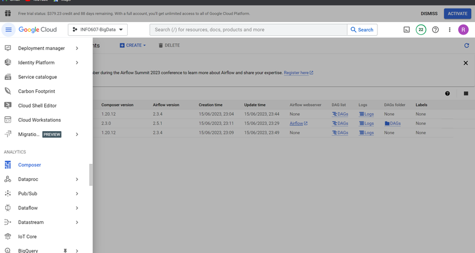

**Step 02: - Once entered into google composer it will look something like this.**

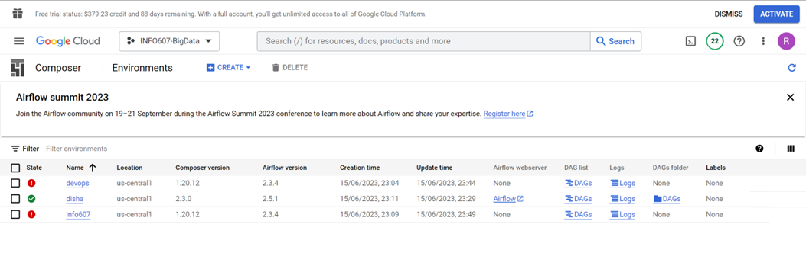

**Step 03: - Post that go to create environment and select Composer 2 with autoscaling option with airflow 2 which provides better performance.**

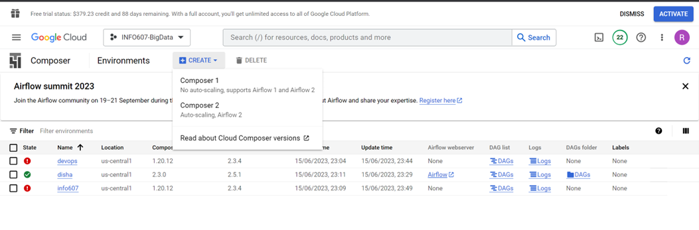

**Step 04: - Once entered into the creation phase select all the default values for everything and select the smaller environment size and then finally click on create environment.**

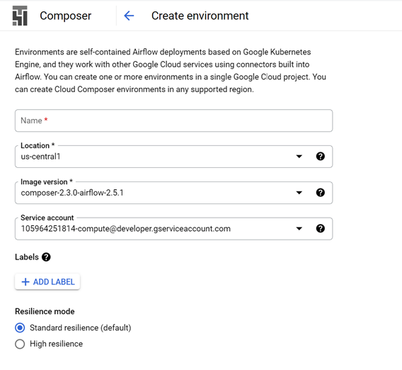
**

**Step 05: - Selecting the appropriate environment size**

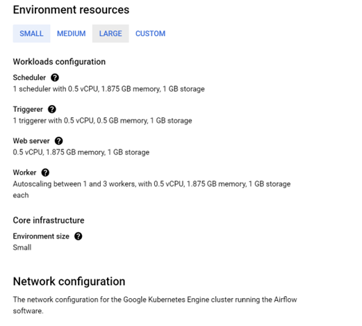

**Step 06: - Selecting the appropriate network configuration and other defaults and finally create the environment. It takes a while for it to be created so we have to wait a bit but once it creates it has everything, the Airflow, The Webserver and the dag folders to execute the ETL pipeline. Please also find below the reference link for the installation steps:**

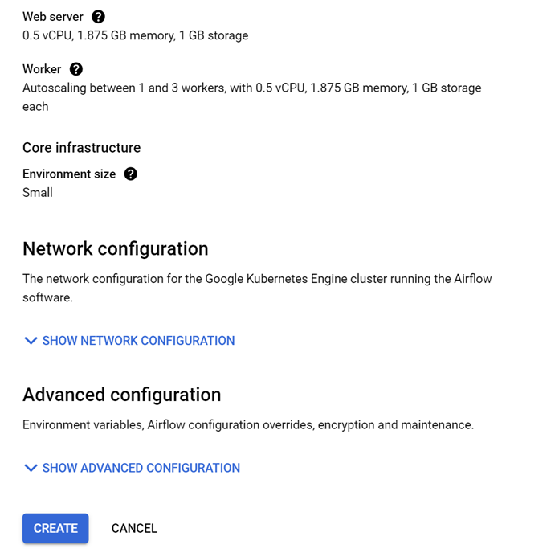

**Cloud Composer documentation. (n.d.). Google Cloud. **

https://cloud.google.com/composer/docs

### BigQuery Schema Snapshots

**1. Staging Schema:-**

 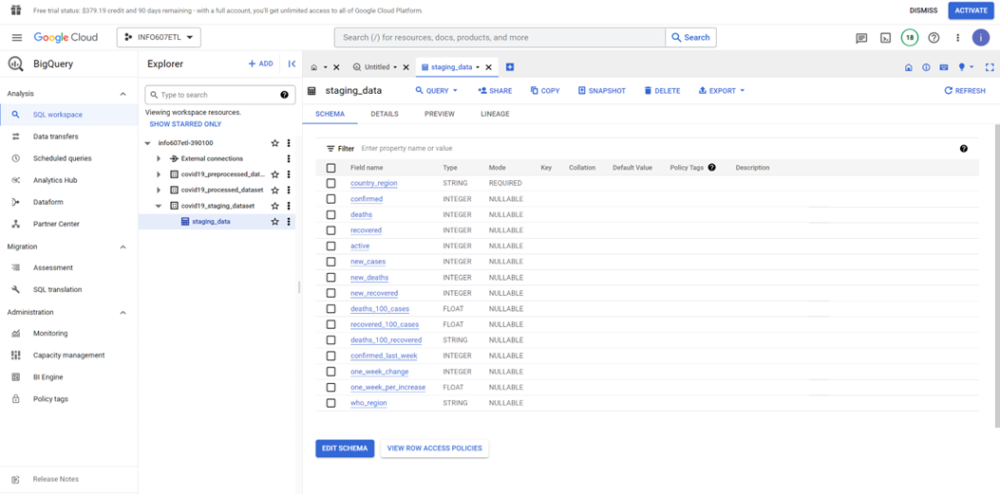

**2. Preprocessed Table Schema:-**

 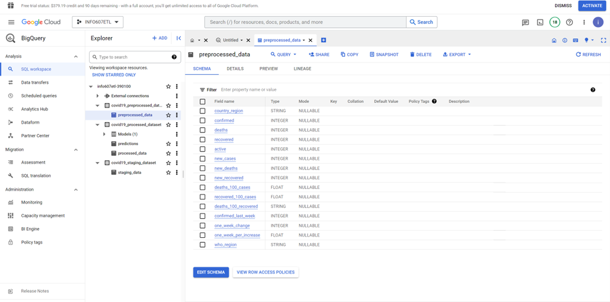

**3. Processed Table Schema:-**

 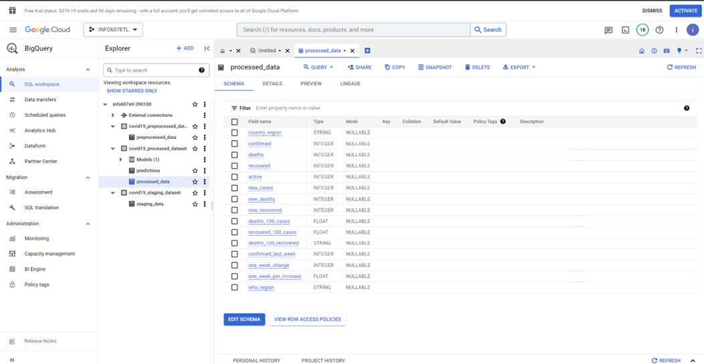

   ### Google Cloud Storage Setup
1. Back to your GCP console, choose Cloud Storage. You can find it on **Storage > Cloud Storage**
2. Click `CREATE BUCKET` button. Then fill some fields such as:
   - Name your bucket (example: blank-space-de-batch1)
   - Choose where to store your data
     - I would suggest to choose **Region** option because it offers lowest latency and single region. But if you want to get high availability you may consider to choose other location type options.
     - Then choose nearest location from you
   - Leave default for the rest of fields.
3. Click `CREATE`
4. Your bucket will be created and showed on GCS Browser
    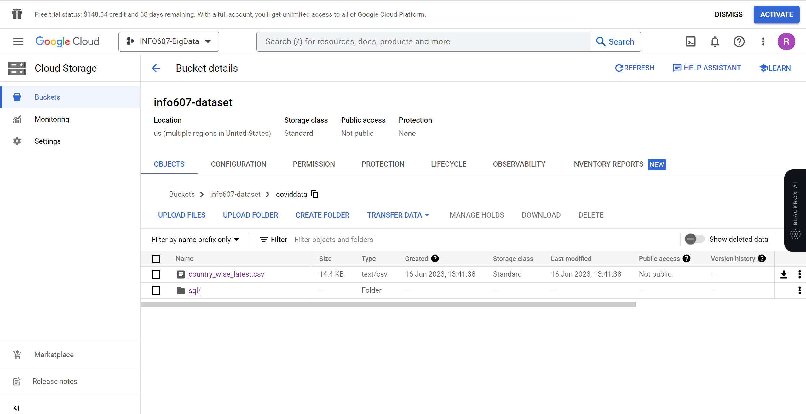
  

## Results

**- This is Training Model Schema:-**

 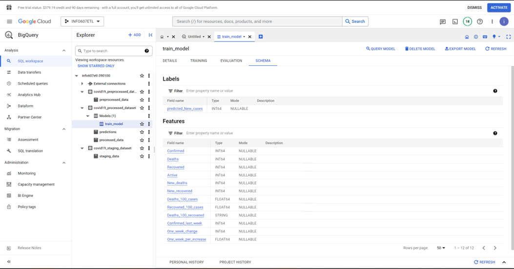

**- Prediction Schema:-**

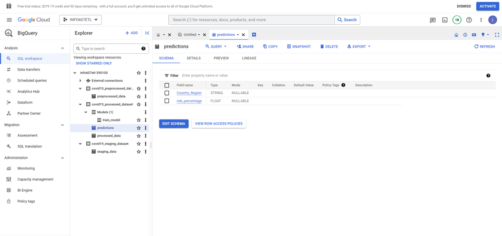

**- Staging Table Output**

  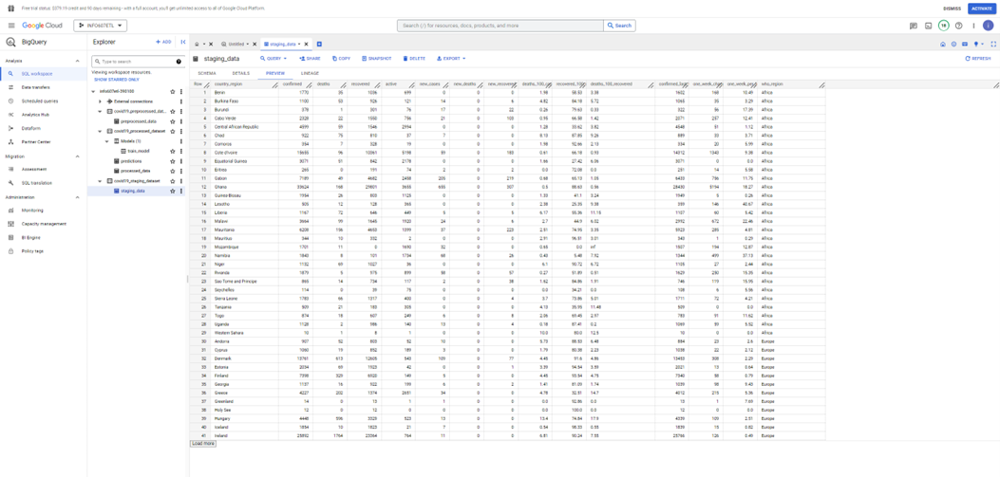

**Preprocessed Table Output**

 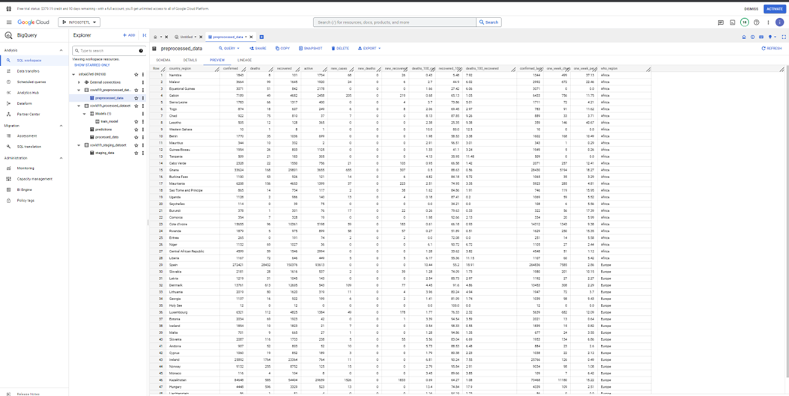

**Processed Table Output**
   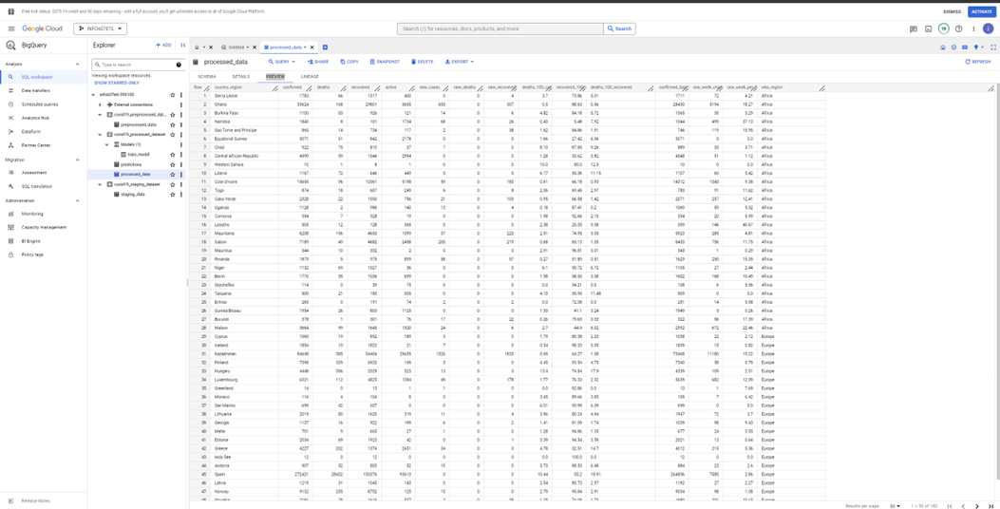

**ETL Pipeline**
  

**Training Model**
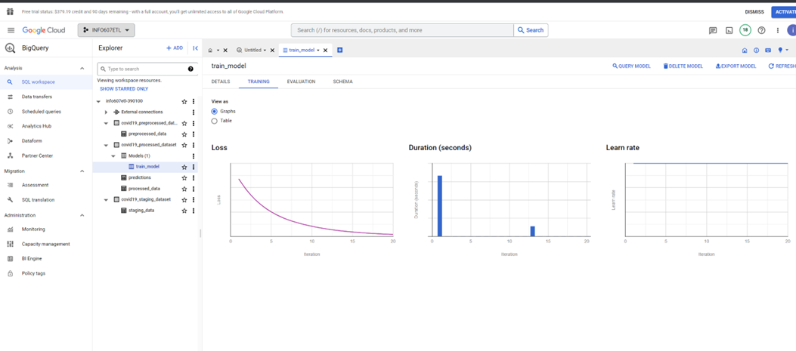

**Evaluation Model**
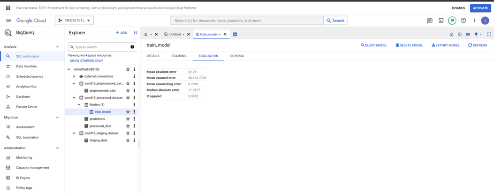

**Predictions**
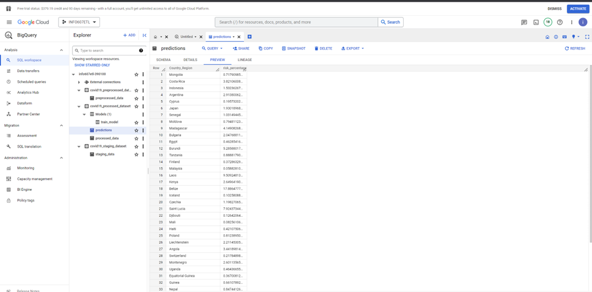

 Additionally, I created a Power BI dashboard by connecting Google Cloud Platform (GCP) to Power BI, enabling interactive visualizations and real-time insights from the processed data.

This dashboard provides a comprehensive view of COVID-19 trends, leveraging BigQuery data to drive data-driven decision-making.

 
