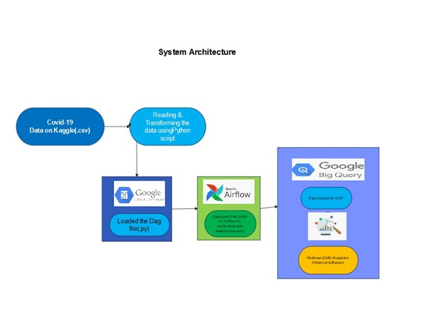
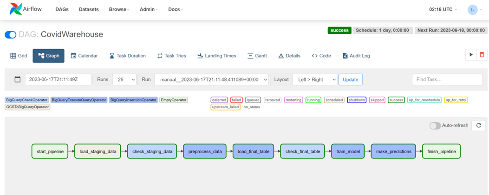
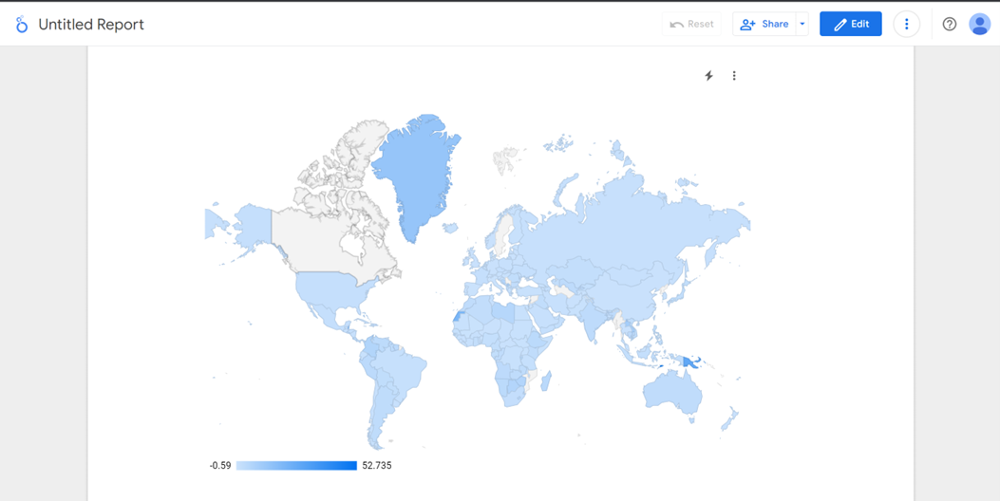

**##Project Title:-**

**Implementing an ETL Pipeline Using Big Query and Airflow for Covid-19 Data****

## **Architecture Overview**

## **Data Sources**
1. Kaggle
2. Comma separated values (CSV)
3. Excel (xls, xlsx)
4. JSON

## **Tech Stacks**
1. Python (v3.8.5)
2. Apache Airflow (v2.5.0)
3. Google Cloud Storage (GCS)
4. Google BigQuery
5. Google Composer

## **Installation Setup**
### Setup the Computing Environment
**Step 01: - Go and create a free account on Google Cloud Platform (GCP). Once logged in click on the console it will take you in and post that go to google Composer to setup the environment for the project**

**Step 02: - Once entered into google composer it will look something like this.**

**Step 03: - Post that go to create environment and select Composer 2 with autoscaling option with airflow 2 which provides better performance.**

**Step 04: - Once entered into the creation phase select all the default values for everything and select the smaller environment size and then finally click on create environment.**

**

**Step 05: - Selecting the appropriate environment size**

**Step 06: - Selecting the appropriate network configuration and other defaults and finally create the environment. It takes a while for it to be created so we have to wait a bit but once it creates it has everything, the Airflow, The Webserver and the dag folders to execute the ETL pipeline. Please also find below the reference link for the installation steps:**

**Cloud Composer documentation. (n.d.). Google Cloud. **

https://cloud.google.com/composer/docs

### BigQuery Schema Snapshots

**1. Staging Schema:-**

 

**2. Preprocessed Table Schema:-**

 

**3. Processed Table Schema:-**

 

   ### Google Cloud Storage Setup
1. Back to your GCP console, choose Cloud Storage. You can find it on **Storage > Cloud Storage**
2. Click `CREATE BUCKET` button. Then fill some fields such as:
   - Name your bucket (example: blank-space-de-batch1)
   - Choose where to store your data
     - I would suggest to choose **Region** option because it offers lowest latency and single region. But if you want to get high availability you may consider to choose other location type options.
     - Then choose nearest location from you
   - Leave default for the rest of fields.
3. Click `CREATE`
4. Your bucket will be created and showed on GCS Browser
    
  

## Results

**- This is Training Model Schema:-**

 

**- Prediction Schema:-**

**- Staging Table Output**

  

**Preprocessed Table Output**

 

**Processed Table Output**
   

**ETL Pipeline**
  

**Training Model**

**Evaluation Model**

**Predictions**

**Final Prediction Visualization Report**

## How to Use
**Step 01: - Sign in on the Google Cloud Platform (GCP) using the GCP credentials**

**Environment Credentials (Google Composer): -**

     gmail id: - ***************@gmail.com
     Password: - ***************

**Step 02:- Once logged in create a project named "info607etl" and select it.**

**Step 03:- Create a bucket in the cloud storage where the source data files will be stored under the folder covid19/**

**Step 04:- For the project execution, first create all the required BigQuery tables in the Bigquery utility by referring the dag files**

**Step 05:- Then go to the composer screen and launch the Airflow webserver wherein just run the created DAG named "CovidWarehouse" and you can see the etl pipeline executing.**

**Step 06: - Also, do check in the Airflow GUI there will be /dags folder to check the code we are utilizing to execute the automated workflow scheduling for ETL pipelining through dag scripts written in python.**

**Step 07: - Cross verify the output with BigQuery and check whether all the data has been properly transferred to the staging, preprocessing and final tables or not. Query and check the outputs.**

**Step 08: - Finally check the prediction results using the tool LookStudio. (Google Lookstudio is a tool that directly gets connected with your BigQuery and GCP Interface).**

**Step 09:- You can watcch the demo of the project by referring the following link:-****

https://shorturl.at/imMR7

 
